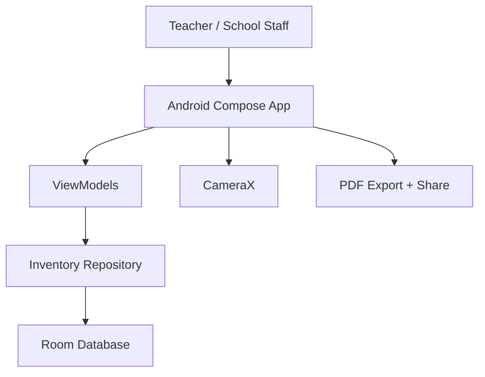
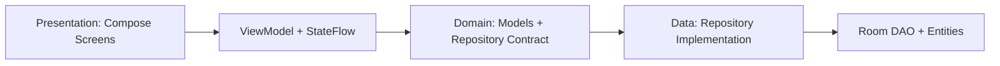
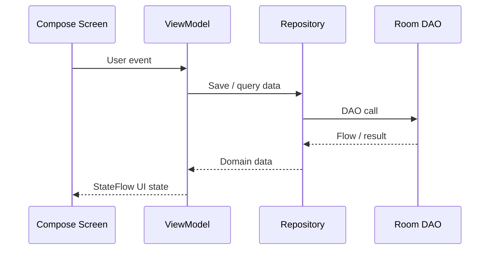
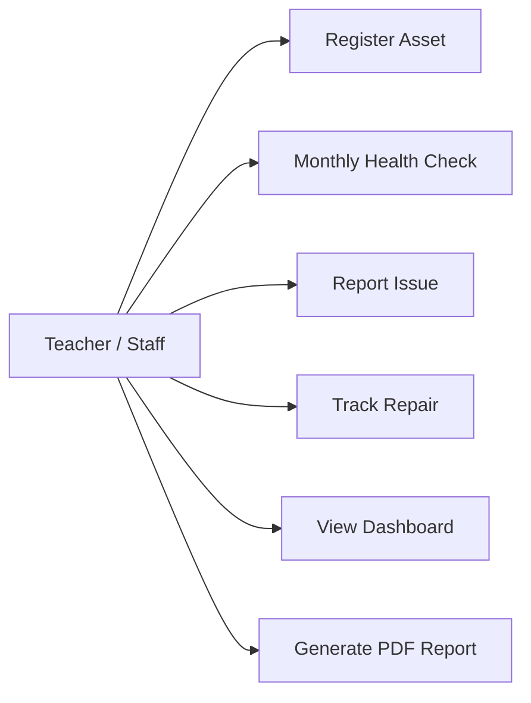
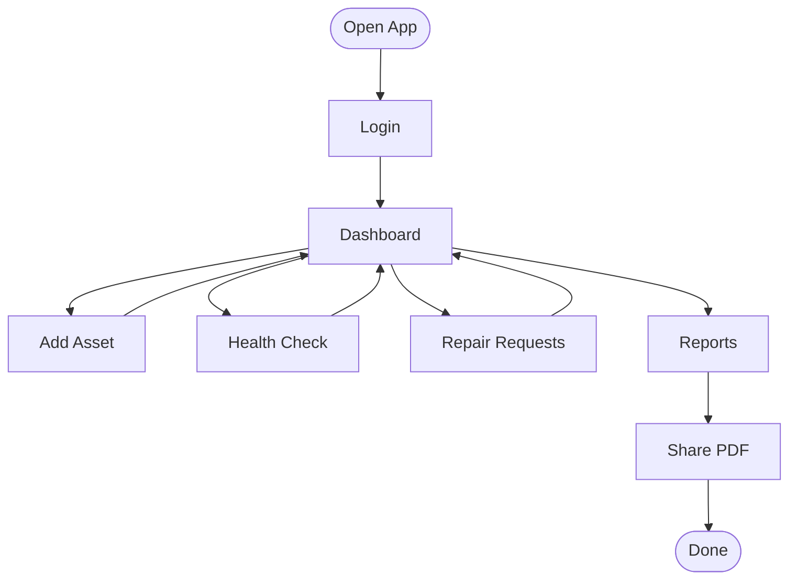
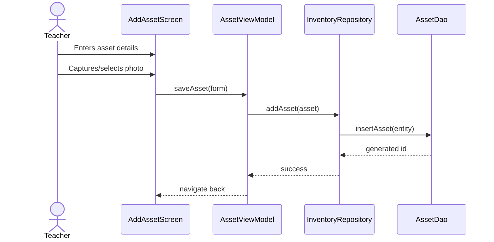
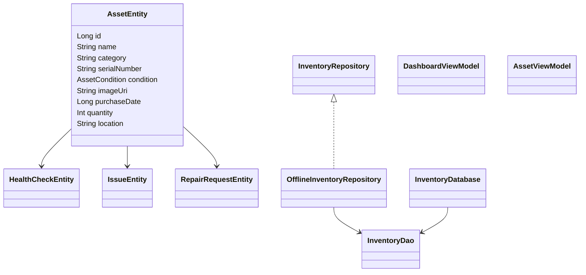

# Namma-Shaale Inventory - Digital Asset Auditor

## Tech Stack

- Kotlin
- Jetpack Compose + Material 3
- MVVM + Repository Pattern
- Room Database
- StateFlow + Coroutines
- Compose Navigation
- CameraX
- Android PDF export + share intent

## Open In Android Studio

1. Open Android Studio.
2. Select **Open**.
3. Choose this folder: `C:\Users\harsh\OneDrive\Documents\New project`.
4. Let Gradle sync.
5. Run the `app` configuration on an emulator or Android phone.

## Beginner Build Roadmap

Day 1: Open project, sync Gradle, run the app.
Day 2: Study `data/local/entity` and Room annotations.
Day 3: Study DAO queries and Flow.
Day 4: Study repository functions.
Day 5: Study ViewModel state with StateFlow.
Day 6: Build and test Dashboard.
Day 7: Build and test Add Asset.
Day 8: Build Asset Details and Health Check.
Day 9: Build Issue Log and Repair list.
Day 10: Add CameraX photo capture.
Day 11: Generate report statistics.
Day 12: Export PDF and share.
Day 13: Add validation and empty states.
Day 14: Polish Material 3 UI.
Day 15: Prepare interview explanation and demo script.

## Architecture Summary

The app uses a beginner-friendly clean architecture layout:

- `data`: Room entities, DAO, database, repository implementation.
- `domain`: enums and repository contract.
- `presentation`: Compose screens, ViewModels, navigation, reusable UI.
- `util`: PDF and file helpers.

ViewModels expose immutable `StateFlow` to Compose screens. Screens send user events to ViewModels. ViewModels call the repository. The repository talks to Room and returns Flows.

## Diagrams

### High Level System Architecture

### Clean Architecture

### MVVM Flow

### Use Case Diagram

### Activity Diagram

### Sequence Diagram: Add Asset

### Class Diagram

