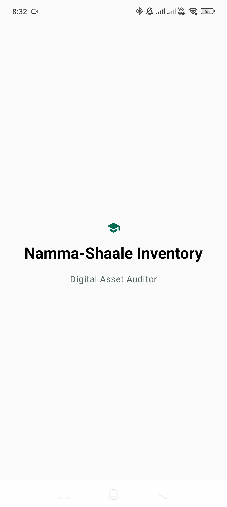
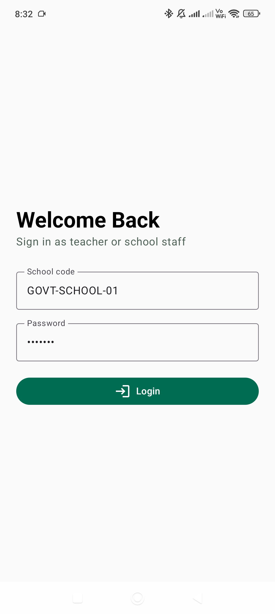
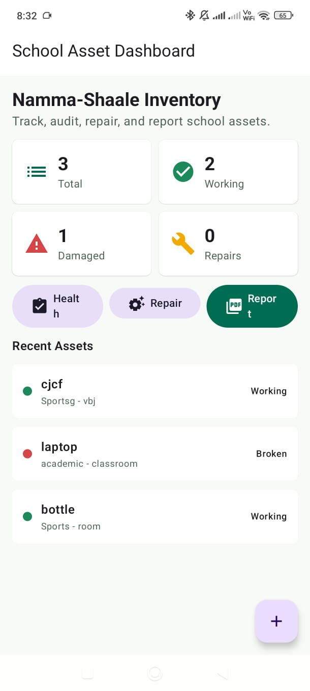
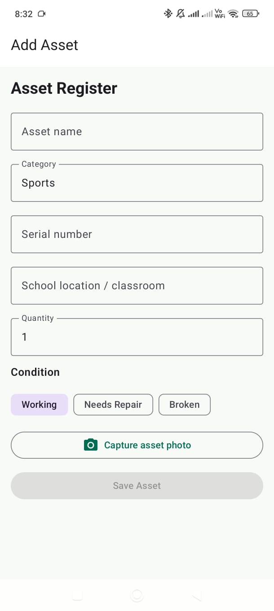
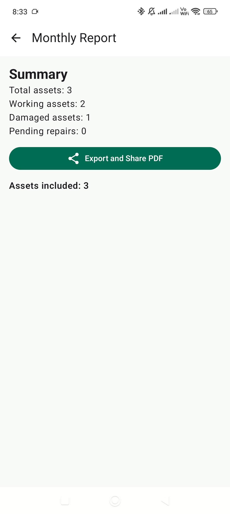

# Namma-Shaale Inventory

A native Android inventory auditing app built for schools and staff. Namma-Shaale Inventory helps teachers and administrators manage classroom assets, monitor equipment health, log repair requests, capture photos, and generate PDF reports.

## Project Overview

This app is designed to support local school inventory workflows by storing asset information on-device, tracking maintenance status, and exporting reports for documentation. It is built using modern Android tooling and clean architecture principles.

## Features

- Add and manage inventory assets
- View a dashboard summary of asset counts and statuses
- Track monthly asset health checks
- Log issues and repair requests
- Capture asset photos using CameraX
- Generate and share PDF reports
- Persist data locally with Room Database
- Smooth Compose UI with navigation and state handling

## Tech Stack

- Kotlin
- Android Jetpack Compose
- Material 3
- MVVM architecture
- Room Database
- StateFlow + Coroutines
- Compose Navigation
- CameraX
- PDF export and Android share intent

## Requirements

- Android Studio Electric Eel or newer
- Android SDK 33+ installed
- JDK 17 or compatible
- `./gradlew` wrapper included in repo

## Build and Run Instructions

1. Clone the repository:

```bash
git clone https://github.com/harshakc241/Namma-Shale-app.git
cd "Namma-Shale-app"
```

2. Open the project in Android Studio.
3. Allow Gradle sync to complete.
4. Run the `app` configuration on an emulator or a physical Android device.

### Command-line build

```bash
./gradlew clean assembleDebug
./gradlew build
```

## Screenshots

The following app screens are included as visual documentation for the submission. Add corresponding image files to the `screenshots/` folder with the names below.

<table>
  <tr>
    <td></td>
    <td></td>
  </tr>
  <tr>
    <td></td>
    <td></td>
  </tr>
  <tr>
    <td></td>
    <td></td>
  </tr>
</table>

## Project Structure

- `app/src/main/java/com/nammashaale/inventory`
  - `data`: Room entities, DAO, database, and repository implementation
  - `domain`: enums and repository interface contracts
  - `presentation`: Compose screens, ViewModels, navigation, and UI components
  - `util`: PDF export, file sharing, and helper utilities
- `app/src/main/res`: resources and UI assets
- `app/src/main/AndroidManifest.xml`: Android app configuration
- `build.gradle.kts`, `settings.gradle.kts`, `gradle.properties`: project configuration
- `gradle/wrapper`: Gradle wrapper files

## Why This Project Works for Submission

- Contains real Kotlin source code and Android project files
- Includes Gradle build files for automated build checks
- Has a clear architecture and modular code layout
- Supports a concrete use case for school inventory and maintenance
- Includes a README with setup instructions and feature details

## Future Improvements

- Add cloud sync or remote backend support
- Add user authentication and role-based access
- Add search and filter for assets
- Add CSV export or dashboard charts
- Improve screenshots and demo documentation
